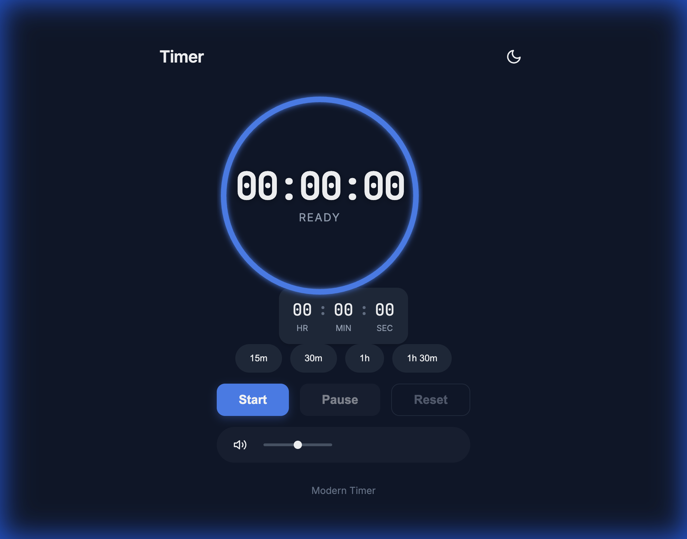

# Class Break Timer

A sleek, modern countdown timer built with vanilla HTML, CSS, and JS. Designed for classrooms, study sessions, and productivity.



## 🔗 Demo
[**Live Demo**](https://alfredang.github.io/timer-countdown/)

## ✨ Features

- **Minimalist Design**: Clean, dark-themed UI with a centered circular progress indicator.
- **Mobile Optimized**: Fully responsive layout that looks great on all devices.
- **Smart Presets**: Quick-start buttons for 15m, 30m, 1h, and 1h 30m.
- **Manual Input**: Custom time entry with robust reset logic.
- **Visual Feedback**: Smooth transitions and animations for timer states.
- **Sound Alerts**: Audio feedback for buttons and timer completion.

## 🛠️ Technologies
- **HTML5**: Semantic structure.
- **CSS3**: Modern Flexbox/Grid layouts, CSS Variables, and Animations.
- **JavaScript (ES6+)**: Accurate timing logic using `Date` objects to prevent drift.

## 🚀 Getting Started

1. Clone the repository:
   ```bash
   git clone https://github.com/alfredang/timer-countdown.git
   ```
2. Open `index.html` in your browser.

## 🔊 Sound
To enable sounds, ensure you have `click.mp3`, `start.mp3`, and `alarm.mp3` in the `assets/sounds/` directory. The app falls back to browser-generated beeps if files are missing.
